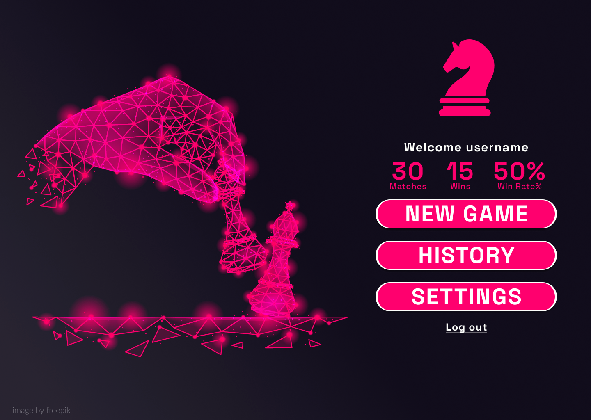

# Cool Forces Chess Game

## Description

- Desktop Chess Game With Interesting Modifications Made To The Typical Chess Rules

## Tech Stack Used

|**Logic** |  |
|--- | --- |
|**UI Design** |  |
|**Database** |  |

## Features

- User Registeration
   

- Color, Opponent, Time Choice

- New Available Moves Different From Normal Chess Rules
  

- Viewing Matches Analytics Like History & Win Rate
  

## Contributors

| Name | GitHub | LinkedIn |
| ---- | ------ | -------- |
| Mostafa Ayman |  |  |
| Abdelrahman Alaa |  |  |
| Tala Emara | |  |
| Salah Mohamed |  |  |